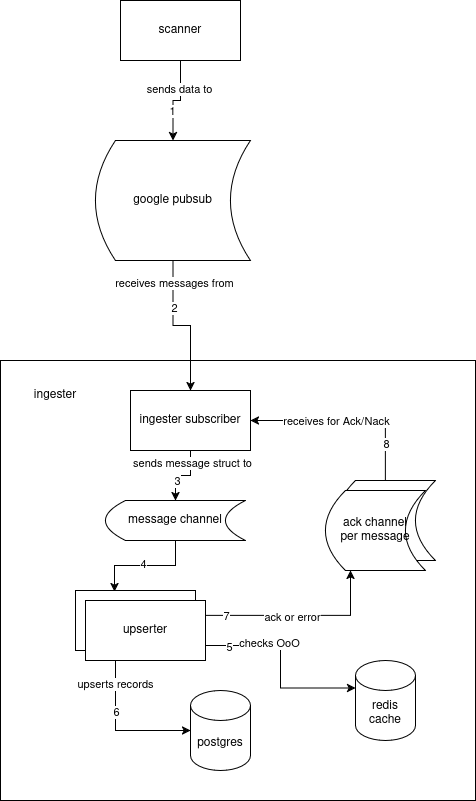

# Mini-Scan

A project demonstrating basic data ingestion for google pubsub.

### Contents
- [Tools used](#tools-used)
- [Instructions to run](#instructions-to-run)
- [Testing](#testing)
- [A note on redis](#a-note-on-redis)
- [Levers to Pull (configuration)](#levers-to-pull)
- [General Architecture](#general-architecture-overview)


## Tools used
 - [golang](https://go.dev/)
 - [docker compose](https://docs.docker.com/compose/)
 - [postgres](https://www.postgresql.org/) (v18)
 - [golang-migrate](https://github.com/golang-migrate/migrate)
 - [redis](https://redis.io/) (optional, see notes)


## Instructions to run
This project can be run in two ways. Either with the environment running and the `ingester` service running on a local machine, or everything running all at once in a demo format.

To run the project in local mode, run `make dev`. From there you can run go run `cmd/ingester/main.go` with the proper environment variables set, or via something like `vscode` with the [launch options set](./.vscode/launch.json) If you want to tear down the dev mode instance, `make down` is a convenience method that can be used.

For the demo mode, run `make demo`. Note that the demo version will not detach from the terminal (because who doesn't like seeing logs as a demo).


On startup, docker will set up the scanner, pubsub emulator, and topic as in the base project. Additionally, it will also spin up postgres and run the migrations before the ingester begins running.

To see the results of the data being entered, check things out with these commands:
```sh
docker exec -it mini-scan-takehome-db-1 psql -U scanner -d scanner_dev

# once inside the container, 
select * from scan_results;
```


a full list of available commands can be seen with `make help`
## Testing

Aside from the manual steps, this project comes with a basic unit test suite. It can be run using `make test`, or `make cover-html` to see a coverage report in your browser.

## A note on redis:
Redis is used to maintain a basic cache ahead of the database for values that have already been entered, or for values that may have come out of order. It's possible to run this solution without redis, as the
scan_results table does have a [uniqueness constraint](./db/migrations/000001_create_scan_results_table.up.sql) that we can use to determine if we should upsert or not. That said, it's a bit kinder to the database to have a cache in front of it.


## Levers to pull:
In keeping with the mantra of the 12-factor application, the `ingester` uses environment variables as configuration. See the [demo env file](./.env.demo) for an overview of whats available.
Please note that many more configuration options _could_ be added (pgPool size, redis pool size, etc), but I ran out of time.

### A quick note on sensitive data
In the interest of time, and the fact that this is a demo environment (and local only), the local database passwords are in fact in the .env files. This can be avoided by adding an entry to the .gitignore and providing an example for users to copy over. I wanted a "one click" solution to start up the demo environment, but didn't have the time to copy an example file and sed/ack through the new env file to add in random passwords in my make commands.

## General architecture overview

The project is pretty simple, The diagram should give a general overview. The scanner will send data to pubsub, and the ingester will subscribe to the topic. From there, it will fan out any messages it receives via a channel to the upserter service. Which will check the cache for OoO or possibly duplicate records. The upserter will hold on to these records for a period of time, or until the batch size is large enough*. From there, a repository upserts the recrods using UNNSET to try to keep database thrashing lower.** Finally, once absorbed, the upserter sends a success response back along a message channel that each record has, where the ingester can mark the message with an `Ack()`

In the event of a failure to upload, we roll back the keys in the cache that are affected, and then send a `Nack()` for the record to be retried.


\* Currently that batch cache is a simple slice. But it could be updated to a more performant data structure, or, if we had multiple machines, we could sent it out to a ring buffer of another service. Similar to how Grafana's mimir works. I ran out of time to try my hand at it.

\** If _very_ high performance is required, moving to a temp table and copying would probably be better.


### Basic Diagram



## Further thoughts
This project lacks proper metrics, but could be added relatively easily. I personally love prometheus and openTelemetry with a grafana stack, but didn't have the time to set it all up in docker compose properly. Given another hour or two, I figure we could have some rather nice grafana dashboards.

Additionally, this could also apply to tracing, although I'm unaware of how google pubsub handles otel traces.